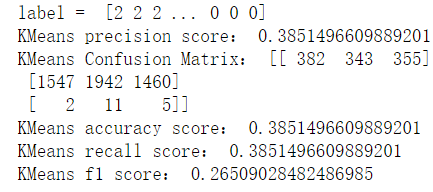

# Final Assignment of Kmeans

## Task
**Your work will be assessed on:**

-   data processing and transformation
-   choosing the right number of clusters for the problem
-   the organization and documentation of your GitHub repository
-   communication of your work in class reflections and final
    presentations
-   model improvement over the semester

**Include with submission:**

-   I used the  `food_enforcement_US_bacteria.json`
    dataset containing  classification 、`center_classification_date`
     reason for recalls. The json file cannot be utilized directly ,thus
    ,I determine to alter the dataset form into a csv file through API
    to\_csv and fully save the whole data into csv .
-   What’s more , I am eager to take many of features of the original
    data including `event_id`, `classification`,
    `center_classification_date`, `report_date`,
    `recall_initiation_date`,`recall_number`,`city`,
     `distribution_pattern`,  `recalling_firm`, `state`,
    `reason_for_recall` , `initial_firm_notification`, `status`,
    `product_description`,  `code_info`  ,  `address_1`,
    `complete_address` in order to better heed the efficiency of kmeans
    process .
-   In addition, I have to clearn the non standard data pertaining to
    NaN data which cannot be utilized in the analysis , thus I decide to
    invoke the API dropna(axis=0) so as to better clear the non standard
    data existing among the whole dataset .
-   For more, The feature class I or class II cannot be fit by the
    Kmeans API，There is no other choice ， I must change all of them
    into 0 、1 and 2 in order to get the final result of the cluster.
-   After observing the feature of the reason of recall , I notice that
    this kind of feature is still cannot be used directly , so, using
    API TfidfVectorizer can absolutely help me turn the character into
    the numeral features which can be calculated by API kmeans
    Algorithm.
-   Before I conducted the kmeans cluster experiment , I set the
    parameter `n_clusters` equal to 3 because I notice that there are 3
    kinds of classes refering to class I 、 class II 、 and Nan class.
    Then ,I have a trail on the feature of `reason_for_recall` .
-   From the kmeans fitting model picture , we can konw that the kmeans
    model  still cannot perfectly fit the whole data ,and the kmeans
    model just exhibits the direct line , thus the kmeans model is
    absolutely the normal model during the fitting period and process of
    cluster cases. The kmeans cluster model efficient is as follows :

From the result in figure, we can get the conclusion that the kmeans
model exhibits the not high precision accuracy and recall, thus kmeans
fitting model could not be the optimal model with the feature of
`reason_for_recall` .

Then， I concatenate the features of `center_classification_date`,
`report_date` with features of recall  so as to observe the kmeans
efficiency. And the cluster of kmeans is as follows :

From result in figure, we can get the conclusion that the kmeans model
exhibits the lower precision accuracy and recall, thus kmeans fitting
model couldnot be the optimal model with the combination feature of  
`center_classification_date`, `report_date` with feature of reason of
recall .

Then， I concatenate the features of ` distribution_pattern` with the
feature of reason of recall so as to observe the kmeans efficiency. And
the cluster of kmeans is as follows :

From the result in figure, we can get the conclusion that the kmeans
model exhibits the highest precision accuracy and recall, thus kmeans
fitting model couldnot be the optimal model with the combination feature
of  ` distribution_pattern ` with feature of reason of recall.

I still take other features in exploring final kmeans cluster result
，the result figure is as follows：

At last，I concatenate the features of
distribution `product_description` with feature of reason of recall so
as to observe the kmeans efficiency. And the cluster of kmeans is as
follows :

## Conclusion

From the result in figure, we can get the conclusion that the kmeans
model exhibits the most optimal and highest  precision accuracy and
recall, thus kmeans fitting model could be the optimal model with the
combination feature of   ` product_description ` with feature of reason
